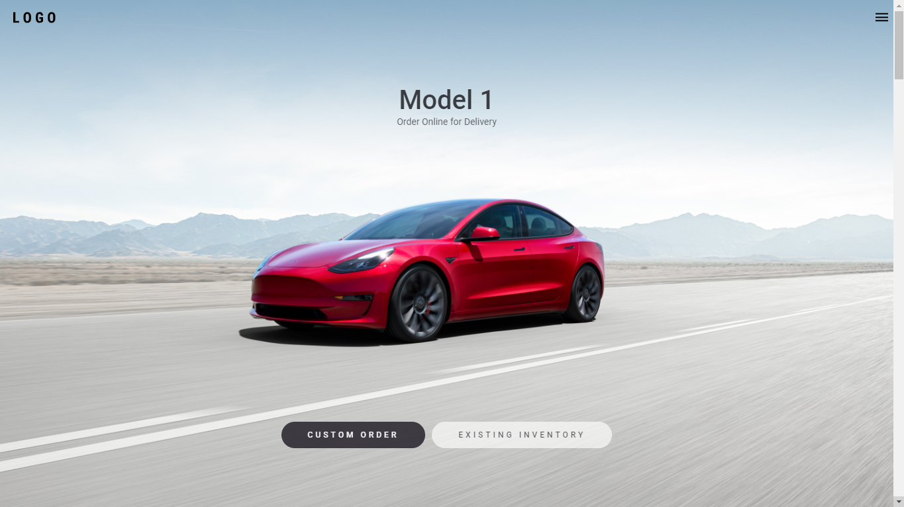

<p align="center">
    
</p>

# React Tesla

> Homepage of Tesla with React, Content, Hooks, TypeScript, Styled-Components and Framer Motion.

this open source project was made for studies, and aims to replicate the Tesla homepage.<br />
All rights to Tesla. <br />
Be sure to send your feedback.

## Technology stack

- **Front-end:** [React.Js](https://reactjs.org/)
- **Typing:** [Typescript](https://www.typescriptlang.org/)
- **Build:** [Vite](https://vitejs.dev/)

## Running locally

1. Clone this repo:

```sh
$ git clone https://github.com/iamdevmarcos/react-tesla.git
```

2. Then go to the project's folder:

```sh
cd react-tesla
```

3. Install all dependencies:

```sh
npm install
```

4. Run locally:

```sh
npm run dev
```

## Autor

| [<br><sub>@iamdevmarcos</sub>](https://github.com/iamdevmarcos) |
| :---------------------------------------------------------------------------------------------------------------------------------------: |
